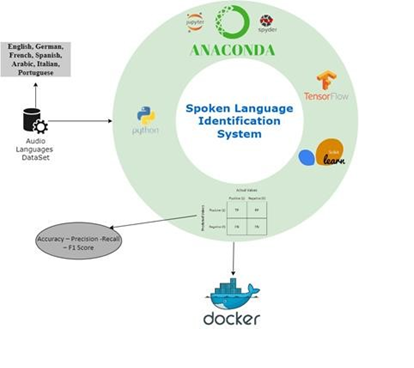

# Spoken language detection

## Problem Definition
Language is essential for people to communicate with each other, and as we know there is a lot of data about languages that find their way into digital form, and with the increase in the amount of this data being published on the web, knowing the natural language of all these pieces of data is one of the most important processes because Natural Language Processing (NLP) depends on it.  Moreover, the main products of many major technology companies, including Google, Microsoft, Apple, and Amazon almost now include voice assistants.Language Identification System is a crucial initial step to improving user experience on ASR, VA, speaker diarization, or any voice-related AI models. There are several commercial and practical uses for Language Identification.

## Selected languages
- Arabic
- Italian
- Spanish
- Portuguese
- German 
- French
- English

## DataSet
The Data is Audio files collected from serval datasets VoxForg, Mozila common voice and some audio from YouTube

## Methodology

Since we are working with audio data will be investigate multiple approach to get the optimal result in the methodology part,
we will try two main approaches which are: 

- Using the image by generating spectrum images using transformers like Fourier Transform which is made from same length data (between 6 and 9 second) [3]  and then applying different deep learning algorithms (CNN, Alix net, LSTM, RNN, CNN-LSTM) on the generated images which will help us since it will ignore the noise in the records easier and then we will find the best architect that will result in the highest accuracy matrix (F1 score, recall, precision)

- Using the row data directly to some signal analysis and then turning them into array points then apply deep learning algorithms (ANN, LSTM, RNN, CLSTM, CRNN) then we will find the best architect that will result in the highest accuracy matrix (F1 score, recall, precision)

- Also,we will try to apply different approacheslike working with the cepstrum image which is considered as the inverse of spectrum image which may give us more intuition and more fruitful results.

## Tools

